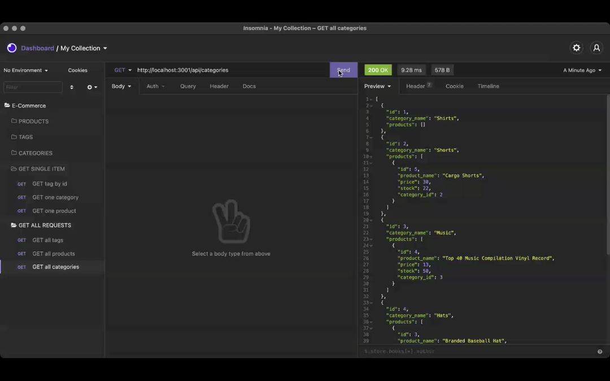

# E-COMMERCE BACK END


# Table of Contents:
- [License](#license)
- [Description](#description)
- [User Story](#userstory)
- [Criteria](#criteria)
- [Usage](#usage)
- [Packages](#packages)
- [Issues](#issues)
- [Questions](#questions)
- [Credits](#credits)

  
# License

[MIT](https://opensource.org/licenses/MIT)


# Description
This application is a simple back end for an e-commerce site using provided starter code as well as express.js, sequelize and insomnia to test api calls.


# User Story
```md
AS A manager at an internet retail company
I WANT a back end for my e-commerce website that uses the latest technologies
SO THAT my company can compete with other e-commerce companies
```


# Criteria
```md
GIVEN a functional Express.js API
WHEN I add my database name, MySQL username, and MySQL password to an environment variable file
THEN I am able to connect to a database using Sequelize
WHEN I enter schema and seed commands
THEN a development database is created and is seeded with test data
WHEN I enter the command to invoke the application
THEN my server is started and the Sequelize models are synced to the MySQL database
WHEN I open API GET routes in Insomnia Core for categories, products, or tags
THEN the data for each of these routes is displayed in a formatted JSON
WHEN I test API POST, PUT, and DELETE routes in Insomnia Core
THEN I am able to successfully create, update, and delete data in my database
```


# Usage
To work this ecommerce backend, firstly, log into mysql and enter source schema.sql within the terminal. This is to make sure the database has been created. 

After quitting mysql, enter 'npm run seed' in a new terminal to seed the database with data.

Then, to activate the server, enter 'node server.js' in the terminal.

After making the localhost is listening on the specified port, head over to Insomnia to test the http requests like below.




# Packages
This application uses the following packages:
 * [Inquirer package](https://www.npmjs.com/package/inquirer).

 * [MySQL2 package](https://www.npmjs.com/package/mysql2).

 * [Sequelize](https://www.npmjs.com/package/sequelize).

As well as [Insomnia](https://insomnia.rest/)


# Questions
If you have any queries or questions in relation to this application, please send them to madeleine.codes@gmail.com.


# Credits
https://github.com/madeleinesc